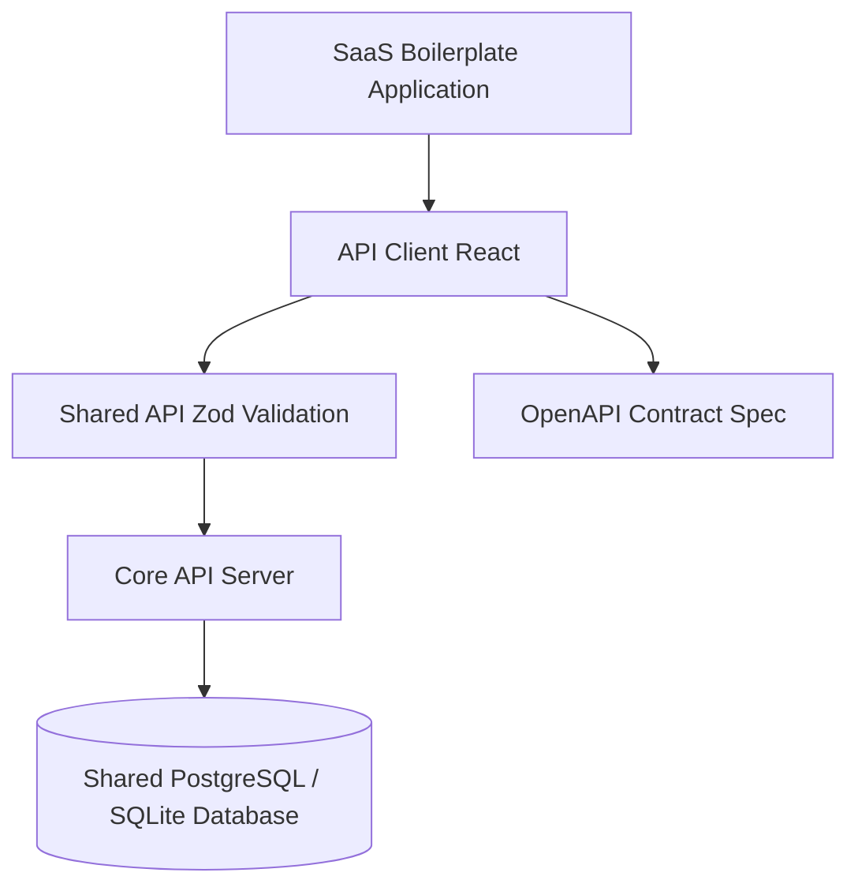

# Mission Control: Multi-Service Enterprise Platform Monorepo

Enterprise operations and SaaS management monorepo architected with pnpm workspaces, shared Zod contract validation, and isolated micro-services.



## Workspace Organization

The repository is structured as a modular monorepo enforcing separation of concerns between shared validation contracts, database clients, and deployment targets:

- **`artifacts/saas-boilerplate/`**: Flagship enterprise SaaS management interface featuring user authentication, billing workflows, and operational metrics.
- **`artifacts/api-server/`**: Express / Node.js API server handling data mutations, token verification, and health probe telemetry.
- **`lib/api-zod/`**: Single source of truth for runtime payload validation schemas across client and server.
- **`lib/api-spec/`**: API boundary contracts and route definitions.
- **`lib/api-client-react/`**: Strongly-typed React query hooks and API wrapper methods.
- **`lib/db/`**: Database client abstractions, schema definitions, and migration scripts.

## Technology Stack

- **Monorepo Manager**: pnpm workspaces
- **Frontend**: React 18, Vite, Tailwind CSS, Lucide Icons
- **Backend**: Node.js, Express, Zod, TypeScript
- **Containerization**: Docker, Docker Compose, Nginx reverse proxy

## Getting Started

```bash
# Install dependencies across all packages
pnpm install

# Start development servers
pnpm run dev
```
