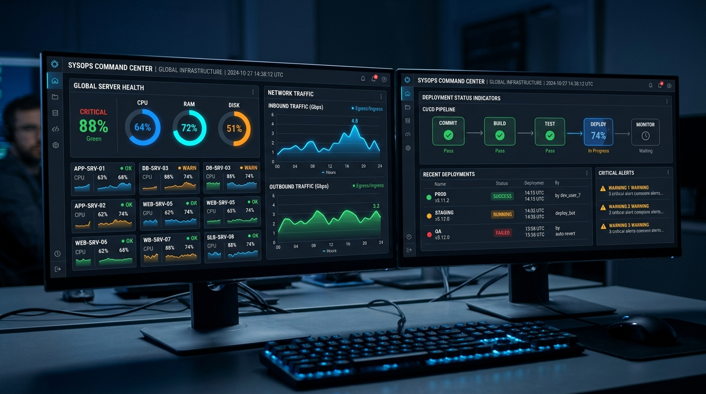

# Mission Control

## Purpose
Operations dashboard for monitoring system health and deployments.

## Tech Stack
React admin dashboard, Node.js agent.

## How to Run Locally
1. Install dependencies: npm install
2. Set environment variables (see .env.example)
3. Run dev server: npm run dev

## Architecture
Agent-based polling.

## UI Mockup

